# Refactoring Applciation to Cloud Native
#  clone project
git clone https://github.com/microsoft/MCW-Cloud-native-applications


สร้าง private/public key pair สำหรับใช้ในการ SSH จาก Azure Cloud Shell
```
ssh-keygen -t RSA -b 2048 -C admin@fabmedical
```
ไปแก้ไข Azure Resource Manager ไฟล์ที่ arm/azuredeploy.json
```
# copy ค่าจาก public key มาแทนที่ template key
"VirtualMachineAdminPublicKeyLinux"
```

ให้ตั้ง Suffix ตามชื่อองค์กรของตัวเอง

```
location=southeastasia

suffix=ntt

az group create -l "$location" -n "fabmedical-$(echo $suffix)"

az ad sp create-for-rbac --role="Contributor" --name="http://fabmedical-sp-$(echo suffix)"
```
ผลลัพธ์
```
{
  "appId": "6d797be5-d3da-4154-9ddb-295dd564f7f7",
  "displayName": "fabmedical-sp-company",
  "name": "http://fabmedical-sp-company",
  "password": "zCt9UO~CPJJX9oO~fr6cJIg91qB8y10T0N",
  "tenant": "b66e8a85-6c39-4a65-bcdf-07fe27841eeb"
}
supakorn@Azure:~$ az ad sp show --id {appId} --query "{objectId:@.objectId}"
Service principal '{appId}' doesn't exist
supakorn@Azure:~$ az ad sp show --id 6d797be5-d3da-4154-9ddb-295dd564f7f7 --query "{objectId:@.objectId}"
{
  "objectId": "3a588f0c-b72c-498b-bbe7-50f64254cf40"
}
```
สั่งสร้าง resource จาก ARM
```
az deployment group create --resource-group "fabmedical-$(echo $suffix)" --template-file azuredeploy.json --parameters azuredeploy.parameters.json
```

```
     "CosmosLocation": {
            "value": "southeastasia"
        },
        "CosmosLocationName": {
            "value": "East Asia"
        },
        "CosmosPairedLocation": {
            "value": "Southeast Asia"
        },
        "CosmosPairedLocationName": {
            "value": "Southeast Asia"
        }
```


# Init Script for Bastion VM
### *ตั้งแต่ขั้นตอนนี้เป็นต้นไปเราจะอยู่ใน VM ที่สร้างขึ้นมาใหม่ ไม่ได้อยู่ใน Cloud Shell 
ให้เราทำการ shell เข้าไปยัง VM ที่ที่สร้างเสร็จขึ้นมาซึ่ง VM นั้นจะใช้ในการ Development Build Push Container ต่างๆ
โดยสร้าง script ขึ้นมาชื่อไฟล์ว่า init.sh
และมีค่าดั่งนี้
```
#!/bin/bash

sudo apt-get update && sudo apt install apt-transport-https ca-certificates curl software-properties-common

curl -fsSL https://download.docker.com/linux/ubuntu/gpg | sudo apt-key add -

sudo add-apt-repository "deb [arch=amd64] https://download.docker.com/linux/ubuntu $(lsb_release -cs) stable"

sudo apt-get install curl python-software-properties -y

curl -sL https://deb.nodesource.com/setup_12.x | sudo -E bash -

sudo apt-get update && sudo apt-get install -y docker-ce nodejs mongodb-clients

sudo apt-get upgrade -y

sudo apt-get install jq -y

sudo apt install docker-compose -y

sudo npm install -g @angular/cli -y

sudo usermod -aG docker $USER

```

สั่ง run script
```
chmod +x init.sh
./init.sh
```
ตอนนี้เราจะมี dependency พร้อมสำหรับการทำ Lab แล้ว

และให้เรา Clone Project ลงยังเครื่อง VM อีกทีหนึ่ง (Cloud Shell เรา Clone เพื่อใช้ ARM Template) ส่วน VM เครื่องนี้ Clone เพื่อมาทำโปรเจค

```
git clone https://github.com/microsoft/MCW-Cloud-native-applications
```

# วิธีการ Login Container Registry
login เข้าไปยัง container registry ของตน
โดยให้เปลี่ยน Registry Name ให้ตรงกับ ชื่อของตนเอง เพราะว่าชื่อ Registry ต้อง Unique ทั้ง Globalใช้ user name และ password ตามภาพ
```
docker login fabmedicalntt.azurecr.io
```
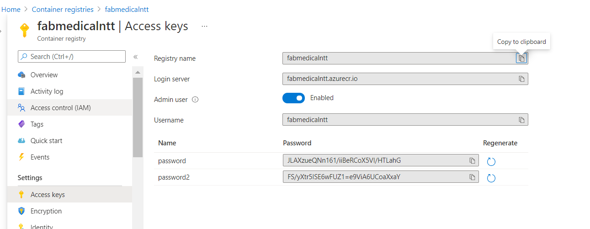
```
adminfabmedical@fabmedical-ntt:~$ docker login fabmedicalntt.azurecr.io
Username: fabmedicalntt
Password:
WARNING! Your password will be stored unencrypted in /home/adminfabmedical/.docker/config.json.
Configure a credential helper to remove this warning. See
https://docs.docker.com/engine/reference/commandline/login/#credentials-store

Login Succeeded
```
# สร้าง Mongo DB ขึ้นมารันที่ Local Port
สร้าง Container Network
```
docker network create fabmedical
```
รัน MongodB Container ที่มีชื่อ Container Name สำหรับใช้ Disvoery คือ mongo และ publish port 27017  
```
docker run --name mongo --net fabmedical -p 27017:27017 -d docker.io/mongo:4.0
```

ใช้คำสั่ง docker exec เพื่อเข้าไปใน Container ของ MongoDB 
```
docker ps

docker exec -it [mongo-id] bash

```
จังหวะนี้เราต้องอยู่ใน container ของ mongo แล้ว
```
root@b171df7220d5:/# mongo
MongoDB shell version v4.0.23
connecting to: mongodb://127.0.0.1:27017/?gssapiServiceName=mongodb
Implicit session: session { "id" : UUID("c5e999d8-7b18-4e93-8ea5-97e8c8450798") }
MongoDB server version: 4.0.23
Server has startup warnings:
2021-03-15T10:34:32.617+0000 I STORAGE  [initandlisten]
2021-03-15T10:34:32.617+0000 I STORAGE  [initandlisten] ** WARNING: Using the XFS filesystem is strongly recommended with the WiredTiger storage engine
2021-03-15T10:34:32.617+0000 I STORAGE  [initandlisten] **          See http://dochub.mongodb.org/core/prodnotes-filesystem
2021-03-15T10:34:33.310+0000 I CONTROL  [initandlisten]
2021-03-15T10:34:33.310+0000 I CONTROL  [initandlisten] ** WARNING: Access control is not enabled for the database.
2021-03-15T10:34:33.310+0000 I CONTROL  [initandlisten] **          Read and write access to data and configuration is unrestricted.
2021-03-15T10:34:33.310+0000 I CONTROL  [initandlisten]
2021-03-15T10:34:33.310+0000 I CONTROL  [initandlisten]
2021-03-15T10:34:33.310+0000 I CONTROL  [initandlisten] ** WARNING: /sys/kernel/mm/transparent_hugepage/enabled is 'always'.
2021-03-15T10:34:33.310+0000 I CONTROL  [initandlisten] **        We suggest setting it to 'never'
2021-03-15T10:34:33.310+0000 I CONTROL  [initandlisten]
---
Enable MongoDB's free cloud-based monitoring service, which will then receive and display
metrics about your deployment (disk utilization, CPU, operation statistics, etc).

The monitoring data will be available on a MongoDB website with a unique URL accessible to you
and anyone you share the URL with. MongoDB may use this information to make product
improvements and to suggest MongoDB products and deployment options to you.

To enable free monitoring, run the following command: db.enableFreeMonitoring()
To permanently disable this reminder, run the following command: db.disableFreeMonitoring()
---

> show collections
>
```
เมื่อแสดงผลลัพธ์ของ Collections จะไม่มีข้อมูลเพราะว่าเรานั้นไม่มีข้อมูลอยู่


# ทดลองใช้ Container สำเร็จรูป
### จะ error เพราะว่าอยู่กันคนล่ะ Namespace
docker run  -d     quay.io/linxianer12/medical-contoso-init-database:1.0.0
docker run  -d  -p 3001:3001  quay.io/linxianer12/medical-contoso-api:1.0.0
docker run  -d  -p 3000:3000  quay.io/linxianer12/medical-contoso-frontend:1.0.0

docker-compose up

docker-compose up -f docker-compose-real.yaml


# Build Project and publish to private registry
### Clone Project ตัวอย่าง


```
sudo chmod +x -R /home/adminfabmedical/.config/

git clone https://github.com/microsoft/MCW-Cloud-native-applications

cd "/home/adminfabmedical/MCW-Cloud-native-applications/Hands-on lab/lab-files/developer/content-api"

docker build -t fabmedicalntt.azurecr.io/content-api:1.0.0 .
```

# ========== VM Deploy ========== 
# 1) รันแอพใน VM ปกติ
### 1.1) Content-Init (Vanila)
เข้าไปในข้างใน Directory API ของ API ที่ใช้สร้าง Schema และ seed Database

cd "/home/adminfabmedical/MCW-Cloud-native-applications/Hands-on lab/lab-files/developer/content-init"

เช็คดู Dependency ในโปรเจค
```
cat package.json
```

ติดตั้ง Dependency
```
npm install
```
ใช้คำสั่ง tmux เพื่อสร้าง Virtual Terminal
และใช้กดคีย์บอร์ด ctrl+b ตามด้วย shift + " เพื่อทำการ Spilt Terminal  
กดคีย์บอร์ด ctrl + b กดลูกศรขึ้นลงเพื่อสลับ Terminal

ลองรันโปรเจค
```
npm run start
```
เข้าไปใน MongoDB อีกทีหนึ่งและลองดู Collection
```
adminfabmedical@fabmedical-ntt:~/MCW-Cloud-native-applications/Hands-on lab/lab-files/developer/content-init$ docker ps                                                                                    [5/153]
CONTAINER ID   IMAGE       COMMAND                  CREATED          STATUS          PORTS                      NAMES
b171df7220d5   mongo:4.0   "docker-entrypoint.s…"   36 minutes ago   Up 35 minutes   0.0.0.0:27017->27017/tcp   mongo
adminfabmedical@fabmedical-ntt:~/MCW-Cloud-native-applications/Hands-on lab/lab-files/developer/content-init$ docker exec -it b17 bash
root@b171df7220d5:/# mongoMongoDB shell version v4.0.23connecting to: mongodb://127.0.0.1:27017/?gssapiServiceName=mongodbImplicit session: session { "id" : UUID("6a3b0c82-8b8e-4403-896f-e799476e21f1") }MongoDB server version: 4.0.23
Server has startup warnings:2021-03-15T10:34:32.617+0000 I STORAGE  [initandlisten]2021-03-15T10:34:32.617+0000 I STORAGE  [initandlisten] ** WARNING: Using the XFS filesystem is strongly recommended with the WiredTiger storage engine2021-03-15T10:34:32.617+0000 I STORAGE  [initandlisten] **          See http://dochub.mongodb.org/core/prodnotes-filesystem
```
แสดง Database
```
> show collections
> show databases
admin      0.000GB
config     0.000GB
contentdb  0.000GB
local      0.000GB
> use contentdb
switched to db contentdb
> show collections
sessions
speakers
```
แสดงข้อมูลใน Colections
```
> db.speakers.find()

{ "_id" : "54606d3bc45bae481bd5156b", "sessions" : [ ], "sessionscodes" : [ ], "tracks" : [ ], "__v" : 0, "bio" : "<b>John C Morris</b> MD is the Friedman Distinguished Professor of Neurology and Director of t$e Charles F. and Joanne Knight Alzheimer's Disease Research Center at Washington University School of Medicine. Dr. Morris has more than 500 published articles. He has received many honors and awards, includin$ the Lifetime Achievement Award from the Alzheimer’s Association (2002); the MetLife Award for Medical Research in Alzheimer’s Disease (2004); the Potamkin Prize for Research in Pick’s, Alzheimer’s, and Relate$ Dementias (2005); and the Peter H. Raven Lifetime Achievement Award from the Academy of Science St. Louis. He is ranked in the top 1% of investigators in the field of Neuroscience and Behavior by Essential Sc$ence Indicators database.", "company" : "Washington University School of Medicine, St Louis, Missouri, USA", "first" : "John", "hidden" : false, "inShow" : "Fall2015", "last" : "Morris", "photo" : "speaker4.jp$", "speakerID" : 1013, "title" : "MD" }
``` 

### 1.2) Content-API (Vanila)
เข้าไปในข้างใน Directory API ของ Backend
```
cd "/home/adminfabmedical/MCW-Cloud-native-applications/Hands-on lab/lab-files/developer/content-api"
```
เช็คดู Dependency ในโปรเจค
```
cat package.json
```

ติดตั้ง Dependency
```
npm install
```
ใช้คำสั่ง tmux เพื่อสร้าง Virtual Terminal
และใช้กดคีย์บอร์ด ctrl+b ตามด้วย shift + " เพื่อทำการ Spilt Terminal  
กดคีย์บอร์ด ctrl + b กดลูกศรขึ้นลงเพื่อสลับ Terminal

ลองรันโปรเจค
```
npm run start
```
ลองดูว่าโปรเจคทำงานได้ไหมจาก terminal
```
adminfabmedical@fabmedical-ntt:~$ netstat -tlpn                                                                                                                                                          [148/526]
(Not all processes could be identified, non-owned process info
 will not be shown, you would have to be root to see it all.)
Active Internet connections (only servers)
Proto Recv-Q Send-Q Local Address           Foreign Address         State       PID/Program name
tcp        0      0 0.0.0.0:27017           0.0.0.0:*               LISTEN      -
tcp        0      0 0.0.0.0:22              0.0.0.0:*               LISTEN      -
tcp6       0      0 :::22                   :::*                    LISTEN      -
tcp6       0      0 :::3001                 :::*                    LISTEN      11240/node
adminfabmedical@fabmedical-ntt:~$ curl localhost:3001/sessions | jq .
  % Total    % Received % Xferd  Average Speed   Time    Time     Time  Current
                                 Dload  Upload   Total   Spent    Left  Speed
100 10456  100 10456    0     0   941k      0 --:--:-- --:--:-- --:--:-- 1021k
[
  {
    "_id": "54b321f979cfa6002dd73477",
    "speakerNames": [
      "Theresa Zesiewicz",
      "Kevin Allison",
      "Israt Jahan",
      "Jessica Shaw",
      "F. Reed Murtagh",
      "Tracy Jones",
      "Clifton Gooch",
```

### 1.3) Content-Web (Vanila)
เข้าไปในข้างใน Directory API ของ Frontend
```
cd "/home/adminfabmedical/MCW-Cloud-native-applications/Hands-on lab/lab-files/developer/content-web"
```
ติดตั้ง Dependency ของ Frontend
```
npm install
```
ทำการ Compile Web ที่เป็น Single Page Application
```
npm run build
```
เราจะนำ static asseet ที่ build ไปวางใน directory สำหรับให้ Node Express Serve Request
```
node app.js
``` 
เข้าไปที่ IP ของ VM เราและเข้าไปที่ Port 3000 เราจะพบกับหน้าเว็บที่มี Data แล้ว

# ========== Container  ========== 
# 2) แปลงให้แอพอยู่ใน Container
เราจะทำการ Build Container Image ขึ้นมาและนำไปเก็บที่ Private Container Registry ซึ่งการที่เราจะ push image ได้เราต้องตั้งชื่อ format image ให้สอดคล้องกับ Container Registry คือ
ซึ่งสิ่งที่ทุกคนต้องเปลี่ยนให้เป็นของตัวเองคือ registry-name ซึ่งจะต้อง unique แตกต่างกันจากตอน Deploy Template Azure Resource Manager (ARM)
ส่วนที่เหลือจะต้้งเหมือนกันได้
```
[registry-name-company].azurecr.io/[image-name]:[tag-version]
``` 
ตัวอย่างเช่น 


ตัวอย่างในคำสั่งใช้ชื่อดั่งนี้ เราจะต้องแก้ sub domain ตัวหน้าสุด (registry-name ให้ตรงกับของตัวเอง)
##### ซึ่ง Format ที่แนะนำคือใช้ [ชื่อตัวเรา-ชื่อบริษัท]
```
# ตัวอย่างในคู่มือ lab จะใช้  fabmedicalntt เสมอซึ่งเราต้องแก้ให้เป็นชื่อเราเอง
fabmedicalntt.azurecr.io/content-init:1.0.0 

# ต้องแก้ค่าดั่งนี้
[my-registry-name].azurecr.io/content-init:1.0.0 

# จะออกมาเป็น
supakorn-ntt.azurecr.io/content-init:1.0.0 
```

### 2.1) content-init (Container)
สร้าง Dockerfile ของแต่ล่ะ Application ใน Directory ที่จะ Build
ใน Directory จะต้องมีไฟล์และโครงสร้างที่มี Dockerfile ใน Directory นั้นๆ
```
adminfabmedical@fabmedical-ntt:~/MCW-Cloud-native-applications/Hands-on lab/lab-files/developer/content-web$ ls
angular.json  browserslist  Dockerfile  karma.conf.js  package.json       README.md  tsconfig.app.json  tsconfig.spec.json  yarn.lock
app.js        dist          e2e         node_modules   package-lock.json  src        tsconfig.json      tslint.json
```
```
FROM node:alpine AS base
WORKDIR /usr/src/app

FROM node:argon AS build
WORKDIR /usr/src/app

# Install app dependencies
COPY package.json /usr/src/app/
RUN npm install

# Bundle app source
COPY . /usr/src/app

FROM base as final
WORKDIR /usr/src/app
COPY --from=build /usr/src/app .
CMD [ "npm", "start" ]
```
เมื่อเราสร้าง Dockerfile ของ content-init แล้วเราก็จะ build Docker Image เพื่อนำมาใช้งานซึ่งให้เราต้องชื่อตาม Format ของ Contaienr Registry
```
docker build -t fabmedicalntt.azurecr.io/content-init:1.0.0 .
```
ทดลองรัน Container content-init ดูว่าทำงานได้ปกติหรือไม่และสั่งให้ Container นั้นอยู๋ Network วงวงเดียวกันกับ fabmedical ที่เราสร้างตอนแรกให้กับ Database MongoDB
```
docker run --net fabmedical  fabmedicalntt.azurecr.io/content-init:1.0.0
```
เราจะ Error ว่าไม่สามารถต่อไปยัง MongoDB ได้ที่ 127.0.0.1:27017
ซึ่งถ้าเราจำหลัก Service Discovery ได้นี่คือปัญหาของการ Fix IP ไว้และด้วย Concept ของ Container นั้นเป็น Fix IP จึงไมไ่ด้ผลดีแน่ๆ เราจะแก้ด้วยการ Refactor Code เราให้ใช้หลักของ 12 Factors เรื่อง Config และ Backing Service
```
adminfabmedical@fabmedical-ntt:~/MCW-Cloud-native-applications/Hands-on lab/lab-files/developer/content-init$ docker run --net fabmedical  fabmedicalntt.azurecr.io/content-init:1.0.0

> content-init@1.0.0 start
> node server.js

Clean Sessions table
(node:19) Warning: Accessing non-existent property 'MongoError' of module exports inside circular dependency
(Use `node --trace-warnings ...` to show where the warning was created)
MongooseError: Operation `sessions.remove()` buffering timed out after 10000ms
Could not connect to MongoDB!
MongooseServerSelectionError: connect ECONNREFUSED 127.0.0.1:27017
npm notice
npm notice New patch version of npm available! 7.6.0 -> 7.6.3
npm notice Changelog: <https://github.com/npm/cli/releases/tag/v7.6.3>
npm notice Run `npm install -g npm@7.6.3` to update!
npm notice
```
เข้าไปแก้ไฟล์ config ของ content-init ที่ directory config/config.js ของ content-init
```
adminfabmedical@fabmedical-ntt:~/MCW-Cloud-native-applications/Hands-on lab/lab-files/developer/content-init$ ls
config  Dockerfile  json  models  package.json  package-lock.json  server.js
adminfabmedical@fabmedical-ntt:~/MCW-Cloud-native-applications/Hands-on lab/lab-files/developer/content-init$ ls config/
config.js
adminfabmedical@fabmedical-ntt:~/MCW-Cloud-native-applications/Hands-on lab/lab-files/developer/content-init$ cat config/config.js
exports.appSettings = {
    db: (function() {
        return  'mongodb://localhost:27017/contentdb';
    })()
};
adminfabmedical@fabmedical-ntt:~/MCW-Cloud-native-applications/Hands-on lab/lab-files/developer/content-init$
```
แก้ไขให้ไฟล์มีค่าดั่งคำชุดโค้ด
###### ~/MCW-Cloud-native-applications/Hands-on lab/lab-files/developer/content-init/config/config.js
ตัวแปร process.env.MONGODB_CONNECTION  คือตัวแปรพิเศษที่ใช้รับตัวแปรผ่าน Environment Variable ได้
```
exports.appSettings = {
    db: (function() {
        return  process.env.MONGODB_CONNECTION || 'mongodb://localhost:27017/contentdb';
    })()
};
```
ผลลัพธ์ตอนแก้สมบูรณ์
```
adminfabmedical@fabmedical-ntt:~/MCW-Cloud-native-applications/Hands-on lab/lab-files/developer/content-init$ cat config/config.js
exports.appSettings = {
    db: (function() {
        return  process.env.MONGODB_CONNECTION || 'mongodb://localhost:27017/contentdb';
    })()
};
```
เราจะสั่ง Build Container content-init อีกรอบหนึ่งโดย tag จะขยับเป็น :1.0.1 เพื่อสื่อถึงว่าเรามีการ FIX เรื่อง Environment Variable ให้สามารถรับจากข้างนอกได้

###### -e "MONGODB_CONNECTION=mongodb://mongo:27017/contentdb"
```
docker build -t  fabmedicalntt.azurecr.io/content-init:1.0.1 .
```
รัน Container content-init ที่แก้ไขแล้วผ่านการรันอีกครั้งหนึ่ง
โดยใช้ argument -e ซึ่งย่อมาจาก Envrionment Variable ที่ต้องการ Inject ตอน runtime
```
docker run --net fabmedical -e "MONGODB_CONNECTION=mongodb://mongo:27017/contentdb"   fabmedicalntt.azurecr.io/content-init:1.0.1 
```
ผลลัพธ์ที่ถูกต้อง Container content-init version 1.0.1 จะสามารถเชื่อมไปยัง Container MongoDB ที่มีชื่อว่า "mongo" ได้ผ่านการ inject ตัวแปรเข้าไป ณ runtime
```
adminfabmedical@fabmedical-ntt:~/MCW-Cloud-native-applications/Hands-on lab/lab-files/developer/content-init$ docker run --net fabmedical -e "MONGODB_CONNECTION=mongodb://mongo:27017/contentdb"   fabmedicalntt.azurecr.io/content-init:1.0.1

> content-init@1.0.0 start
> node server.js

Clean Sessions table
(node:18) Warning: Accessing non-existent property 'MongoError' of module exports inside circular dependency
(Use `node --trace-warnings ...` to show where the warning was created)
(node:18) DeprecationWarning: collection.remove is deprecated. Use deleteOne, deleteMany, or bulkWrite instead.
Connected to MongoDb
All Sessions deleted
Load sessions from JSON file
Session saved successfully
Session saved successfully
Session saved successfully
Session saved successfully
Clean Speakers table
All Speakers deleted
Load Speakers from JSON file
Speaker saved successfully
Speaker saved successfully
Speaker saved successfully
Speaker saved successfully
npm notice
npm notice New patch version of npm available! 7.6.0 -> 7.6.3
npm notice Changelog: <https://github.com/npm/cli/releases/tag/v7.6.3>
npm notice Run `npm install -g npm@7.6.3` to update!
npm notice
```


### 2.2) content-api (Container)

```
FROM node:alpine AS base
RUN apk -U add curl
WORKDIR /usr/src/app
EXPOSE 3001

FROM node:argon AS build
WORKDIR /usr/src/app

# Install app dependencies
COPY package.json /usr/src/app/
RUN npm install

# Bundle app source
COPY . /usr/src/app

FROM base AS final
WORKDIR /usr/src/app
COPY --from=build /usr/src/app .
CMD [ "npm", "start" ]
```
หลังจากสร้าง Dockerfile ของ content-api โครงสร้าง Directory จะต้องมีดั่งนี้

```
adminfabmedical@fabmedical-ntt:~/MCW-Cloud-native-applications/Hands-on lab/lab-files/developer/content-api$ ls
config  controllers  Dockerfile  models  package.json  package-lock.json  routes.js  server.js
```
เมื่อเราสร้าง Dockerfile ของ content-api แล้วเราก็จะ build Docker Image เพื่อนำมาใช้งานซึ่งให้เราต้องชื่อตาม Format ของ Contaienr Registry

```
docker build -t fabmedicalntt.azurecr.io/content-api:1.0.0 .
```
ทดลองรัน Container content-api ดูว่าทำงานได้ปกติหรือไม่และสั่งให้ Container นั้นอยู๋ Network วงวงเดียวกันกับ fabmedical ที่เราสร้างตอนแรกให้กับ Database MongoDB 
```
docker run --net fabmedical  fabmedicalntt.azurecr.io/content-api:1.0.0
```
เมื่อรันไปแล้วจะต้องพบกับ error เหมือนตอนที่ทำ container content-init ซึ่ง Error ก็จะเป็นทำนองเดียวกันคือปัญหาการใช้ 127.0.0.1:27017 ซึ่งไมไ่ด้เป็น Service Discovery Name ของ Container MongoDB ที่มีชื่อว่า Mongo
```
adminfabmedical@fabmedical-ntt:~/MCW-Cloud-native-applications/Hands-on lab/lab-files/developer/content-api$ docker run --net fabmedical --name content-api  fabmedicalntt.azurecr.io/content-api:1.0.0

> content-api@0.0.0 start
> node ./server.js

(node:19) Warning: Accessing non-existent property 'MongoError' of module exports inside circular dependency
(Use `node --trace-warnings ...` to show where the warning was created)
Listening on port 3001

Could not connect to MongoDB!
MongooseServerSelectionError: connect ECONNREFUSED 127.0.0.1:27017
npm notice
npm notice New patch version of npm available! 7.6.0 -> 7.6.3
npm notice Changelog: <https://github.com/npm/cli/releases/tag/v7.6.3>
npm notice Run `npm install -g npm@7.6.3` to update!
npm notice
```
เราจะแก้ไขปัญหานี้ด้วยการไปแก้ไข Configuration ของ content-api ที่ไฟล์
###### ~/MCW-Cloud-native-applications/Hands-on lab/lab-files/developer/content-api/config/config.js
```
adminfabmedical@fabmedical-ntt:~/MCW-Cloud-native-applications/Hands-on lab/lab-files/developer/content-api$ cat config/config.js
exports.appSettings = {
    db: (function(){
        return  'mongodb://localhost:27017/contentdb';
    })()
};
```
ผลลัพธ์ตอนแก้สมบูรณ์
```
adminfabmedical@fabmedical-ntt:~/MCW-Cloud-native-applications/Hands-on lab/lab-files/developer/content-api$ cat config/config.js
exports.appSettings = {
    db: (function(){
        return  process.env.MONGODB_CONNECTION || 'mongodb://localhost:27017/contentdb';
    })()
};
```
เราจะสั่ง Build Container content-api อีกรอบหนึ่งโดย tag จะขยับเป็น :1.0.1 เพื่อสื่อถึงว่าเรามีการ FIX เรื่อง Environment Variable ให้สามารถรับจากข้างนอกได้

###### -e "MONGODB_CONNECTION=mongodb://mongo:27017/contentdb"
```
docker build -t  fabmedicalntt.azurecr.io/content-api:1.0.1 .
```
รัน Container content-init ที่แก้ไขแล้วผ่านการรันอีกครั้งหนึ่ง
โดยใช้ argument -e ซึ่งย่อมาจาก Envrionment Variable ที่ต้องการ Inject ตอน runtime
และตั้งชื่อ container ว่า "content-api" เพื่อให้ container content-web ถัดไปสามารถ Discover เจอจาก Service Name เช่นเดียวกัน
และเปิด Port 3001 ให้สามารถเข้าได้จากภายนอก
```
docker run --net fabmedical --name  content-api  -e "MONGODB_CONNECTION=mongodb://mongo:27017/contentdb"   -p 3001:3001 fabmedicalntt.azurecr.io/content-api:1.0.1 
```
ลองเปิด Browser จะต้องได้พบกับ Backend API ที่รันผ่าน Public IP และ Port 3001

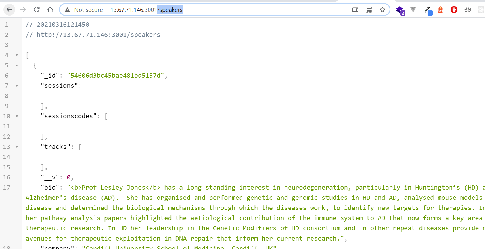


### 2.3) content-web (Container)
```
FROM node:dubnium-alpine AS base
RUN apk -U add curl
WORKDIR /usr/src/app
EXPOSE 3000

FROM node:dubnium AS build
RUN npm install -g @angular/cli@~8.3.4

WORKDIR /usr/src/app

# Install app dependencies
COPY package.json /usr/src/app/
RUN npm install

# Bundle app source
COPY . /usr/src/app
RUN ng build 

FROM base as final
WORKDIR /usr/src/app
COPY --from=build /usr/src/app .
CMD [ "node", "app.js" ]
```
หลังจากสร้าง Dockerfile ของ content-web โครงสร้าง Directory จะต้องมีดั่งนี้
```
adminfabmedical@fabmedical-ntt:~/MCW-Cloud-native-applications/Hands-on lab/lab-files/developer/content-web$ ls
angular.json  app.js  browserslist  Dockerfile  e2e  karma.conf.js  package.json  package-lock.json  README.md  src  tsconfig.app.json  tsconfig.json  tsconfig.spec.json  tslint.json  yarn.lock
```
เมื่อเราสร้าง Dockerfile ของ content-api แล้วเราก็จะ build Docker Image เพื่อนำมาใช้งานซึ่งให้เราต้องชื่อตาม Format ของ Contaienr Registry
แต่อย่างที่เราทราบกันแล้วว่าเรายังต้อง refactor ตัว code ของเราก่อนให้สามารถลองรับกับการ Inject Variable เชื่อมไปหา content-api ได้ดังนั้นในขั้นนี้ถ้าใครอยากไป Refactor Code ให้ถูกต้องต้องเลยก็สามารถข้ามไปขั้นตอนที่ถูกต้องได้เลยใน tag 1.0.1 
แต่เพื่อให้เห็นภาพทั้งกระบวนการเราอาจจะลอง build container 
```
docker build -t fabmedicalntt.azurecr.io/content-web:1.0.0 .
```
แต่หลังจากนี้ก่อนที่เราจะรัน Container content-web version 1.0.0 เราจะดูสถานะของ Container content-api ซึ่งเป็น Backend ของเราก่อนว่ายังทำงานอยู่หรือไม่ ? เพราะ Frontend ซึ่งเป็น Container content-web นั้นจำเป็นต้องเชื่อมต่อกับ Backend นั่นเอง

ใช้คำสั่ง docker ps เราจะพบว่า Container ไม่ได้ทำงานใน background แล้ว
```
adminfabmedical@fabmedical-ntt:~/MCW-Cloud-native-applications/Hands-on lab/lab-files/developer/content-web$ docker ps
CONTAINER ID   IMAGE       COMMAND                  CREATED             STATUS             PORTS                      NAMES
22cc560a36e8   mongo:4.0   "docker-entrypoint.s…"   About an hour ago   Up About an hour   0.0.0.0:27017->27017/tcp   mongo
```
ให้เราใช้คำสั่ง docker ps -a เพื่อดู container ทั้งหมดซึ่งรวมถึง container ที่กำลัง stop ด้วย
```
adminfabmedical@fabmedical-ntt:~/MCW-Cloud-native-applications/Hands-on lab/lab-files/developer/content-web$ docker ps -a
CONTAINER ID   IMAGE                                         COMMAND                  CREATED             STATUS                           PORTS                      NAMES
deef33a69b34   fabmedicalntt.azurecr.io/content-api:1.0.1    "docker-entrypoint.s…"   11 minutes ago      Exited (1) 9 minutes ago                                    content-api
375e83de66d7   fabmedicalntt.azurecr.io/content-init:1.0.1   "docker-entrypoint.s…"   44 minutes ago      Exited (0) 44 minutes ago                                   hardcore_carver
4dad32292390   fabmedicalntt.azurecr.io/content-init:1.0.1   "docker-entrypoint.s…"   45 minutes ago      Exited (255) 45 minutes ago                                 tender_mccarthy
43d5e3a45040   fabmedicalntt.azurecr.io/content-init:1.0.1   "docker-entrypoint.s…"   45 minutes ago      Exited (126) 45 minutes ago                                 xenodochial_stonebraker
d3c2a6827ca5   fabmedicalntt.azurecr.io/content-init:1.0.0   "docker-entrypoint.s…"   About an hour ago   Exited (255) About an hour ago                              brave_aryabhata
22cc560a36e8   mongo:4.0                                     "docker-entrypoint.s…"   About an hour ago   Up About an hour                 0.0.0.0:27017->27017/tcp   mongo
```
จากนั้น start container content-api ขึ้นมาถ้าหากใครพบว่าสถานะของ container content-api นั้น stop ไปแล้ว
```
adminfabmedical@fabmedical-ntt:~/MCW-Cloud-native-applications/Hands-on lab/lab-files/developer/content-web$ docker start content-api
content-api
```
เช็คดูว่า container ที่ชื่อว่า content-api กลับมาทำงานใน background อีกครั้งหรือไม่
```
adminfabmedical@fabmedical-ntt:~/MCW-Cloud-native-applications/Hands-on lab/lab-files/developer/content-web$ docker ps
CONTAINER ID   IMAGE                                        COMMAND                  CREATED             STATUS             PORTS                      NAMES
deef33a69b34   fabmedicalntt.azurecr.io/content-api:1.0.1   "docker-entrypoint.s…"   11 minutes ago      Up 6 seconds       0.0.0.0:3001->3001/tcp     content-api
22cc560a36e8   mongo:4.0                                    "docker-entrypoint.s…"   About an hour ago   Up About an hour   0.0.0.0:27017->27017/tcp   mongo
```
ลองเปิดเว็บ Browser และทดสอบดูอีกทีหนึ่งว่า Endpoint ของ VM IP:3001/speakers นั้นยังทำงานอยู่หรือไม่


ถ้าหากพบว่า Endpoint content-api ทำงานได้ปกติเราจะกลับไป start image content-web version 1.0.0 กันต่อ
โดยเปิด port 3000 เพื่อให้สามารถ forward traffic เข้าไปใน container ได้
```
docker run --net fabmedical  -p 3000:3000 fabmedicalntt.azurecr.io/content-web:1.0.0
```
เมื่อรันไปแล้วจะต้องพบกับหน้า Speaker/ Session ที่ไม่มีข้อมูล ซึ่งปัญหานี้เหมือนกับ container content-init และ content-api ซึ่งปัญหามาจากการที่ Frontend ชี้ไปหา Backend ที่มี endpoint เป็น Hardcode 127.0.0.1:3001 ซึ่งไมไ่ด้เป็น Service Discovery Name ของ Container backend ที่มีชื่อว่า "content-api"
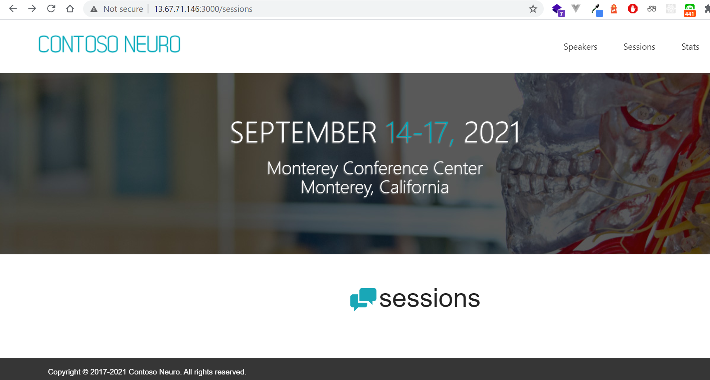

เราจะแก้ไขปัญหานี้ด้วยการไปแก้ไข Configuration ของ content-web ที่ไฟล์
###### ~/MCW-Cloud-native-applications/Hands-on lab/lab-files/developer/content-web/app.js
```
adminfabmedical@fabmedical-ntt:~/MCW-Cloud-native-applications/Hands-on lab/lab-files/developer/content-web$ cat app.js
const express = require('express');
const http = require('http');
const path = require('path');
const request = require('request');

const app = express();

app.use(express.static(path.join(__dirname, 'dist/content-web')));
const contentApiUrl =  "http://localhost:3001";


function getSessions(cb) {
  request(contentApiUrl + '/sessions', function (err, response, body) {
    if (err) {
      return cb(err);
    }
    const data = JSON.parse(body); // Note: ASSUME: valid JSON
    cb(null, data);
  });
}

function getSpeakers(cb) {
  request(contentApiUrl + '/speakers', function (err, response, body) {
    if (err) {
      return cb(err);
    }
    const data = JSON.parse(body); // Note: ASSUME: valid JSON
    cb(null, data);
  });
}

function stats(cb) {
  request(contentApiUrl + '/stats', function (err, response, body) {
    if (err) {
      return cb(err);
    }
    const data = JSON.parse(body);
    cb(null, data);
  });
}

app.get('/api/env', function (req, res) {
  getSpeakers(function (err, result) {
    res.send(process.env)
  });
});

app.get('/api/speakers', function (req, res) {
  getSpeakers(function (err, result) {
    if (!err) {
      res.send(result);
    } else {
      res.send(err);
    }
  });
});
app.get('/api/sessions', function (req, res) {
  getSessions(function (err, result) {
    if (!err) {
      res.send(result);
    } else {
      res.send(err);
    }
  });
});
app.get('/api/stats', function (req, res) {
  stats(function (err, result) {
    if (!err) {
      result.webTaskId = process.pid;
      res.send(result);
    } else {
      res.send(err);
    }
  });
});


app.get('*', (req, res) => {
  res.sendFile(path.join(__dirname, 'dist/content-web/index.html'));
});
const port = process.env.PORT || '3000';
app.set('port', port);

const server = http.createServer(app);
server.listen(port, () => console.log('Running'));
```
เราจะต้องแก้บรรทัดให้สามารถรับตัวแปรเข้ามาได้ด้วยการใช้ process.env.CONTENT_API_URL
```
const contentApiUrl =  "http://localhost:3001";
```
ผลลัพธ์ที่ถูกต้องจะต้องออกมาเป็นไฟล์ app.js ซึ่งมีการรับตัวแปรเหมือนกับ content-init และ content-api ที่ inject ตัวแปร ณ runtime ได้ 
###### ในบรรทัดที่ 9 จะเพิ่มตัวแปร process.env.CONTENT_API_URL
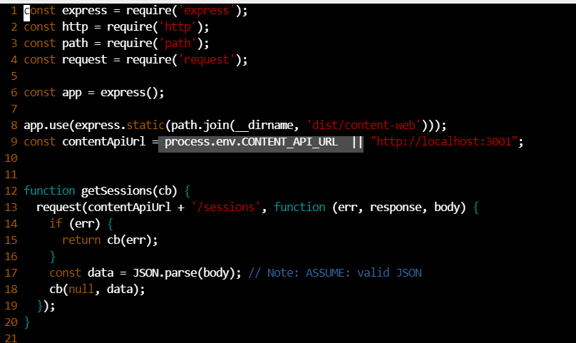

สั่ง build Container Image ของ content-web อีกครั้งหนึ่งโดยมี version tag เป็น 1.0.1
```
docker build -t fabmedicalntt.azurecr.io/content-web:1.0.1 .
``` 
สั่งรัน Container Image frontend ที่พร้อมรับ Environment Variable ใหม่ผ่านคำสั่ง docker run และใช้ envrionment variable เป็น
###### -e "CONTENT_API_URL=http://content-api:3001"
```
docker run --name content-web -p 3000:3000 -e "CONTENT_API_URL=http://content-api:3001"  --net fabmedical fabmedicalntt.azurecr.io/content-web:1.0.1
```
ถ้าเราเซ็ท Environment Variable ถูกต้องเราจะได้ผลลัพธ์ดั่งภาพ 
 

### 2.4) แสดงผลลัพธ์ของ Images ทั้งหมด
Version ที่ถูกต้องจะเป็น tag 1.0.1 ทั้งหมด ส่วน version 1.0.0 จะ FIX Endpoint Hardcode เป็น 127.0.0.1
** ผลลัพธ์ images อาจจะต่างกันแต่ว่าจะต้องมี version 1.0.1 ครบทั้ง content-init, content-api และ content-web 
```
adminfabmedical@fabmedical-ntt:~$ docker images
REPOSITORY                              TAG              IMAGE ID       CREATED          SIZE
fabmedicalntt.azurecr.io/content-web    1.0.1            78bef55b313b   15 minutes ago   474MB
<none>                                  <none>           f9d57149b12f   16 minutes ago   1.45GB
fabmedicalntt.azurecr.io/content-web    1.0.0            5d642f2d4751   34 minutes ago   474MB
<none>                                  <none>           9e2265eae621   36 minutes ago   1.45GB
fabmedicalntt.azurecr.io/content-api    1.0.1            f4629e6a3422   2 hours ago      126MB
<none>                                  <none>           5adcee178f4b   2 hours ago      681MB
fabmedicalntt.azurecr.io/content-api    1.0.0            ed3d1019f5c1   2 hours ago      126MB
<none>                                  <none>           8748bb29ce19   2 hours ago      681MB
fabmedicalntt.azurecr.io/content-init   1.0.1            da4c3945c8f4   2 hours ago      122MB
<none>                                  <none>           588b62ae8cfc   2 hours ago      678MB
fabmedicalntt.azurecr.io/content-init   1.0.0            f50f4c8e9b84   3 hours ago      122MB
<none>                                  <none>           2035e916436a   3 hours ago      678MB
node                                    dubnium          6893652c0370   3 days ago       910MB
node                                    dubnium-alpine   8dd791b3335f   3 days ago       82.7MB
node                                    alpine           8bf655e9f9b2   3 days ago       112MB
mongo                                   4.0              64c108f33354   3 weeks ago      428MB
node                                    argon            ef4b194d8fcf   2 years ago      653MB
```
เราจะทำการ Push Images ทุก version ขึ้นไปยัง Private Container Registry

หากใครยังไม่ได้ login ไปยัง Container Registry ในขั้นตอนแรกให้เราทำการ login อีกครั้ง
```
docker login fabmedicalntt.azurecr.io
```


```
adminfabmedical@fabmedical-ntt:~$ docker login fabmedicalntt.azurecr.io
Username: fabmedicalntt
Password:
WARNING! Your password will be stored unencrypted in /home/adminfabmedical/.docker/config.json.
Configure a credential helper to remove this warning. See
https://docs.docker.com/engine/reference/commandline/login/#credentials-store

Login Succeeded
```
เมื่อ login สำเร็จแล้วให้ทำการ push image ทั้งหมด
```
docker push fabmedicalntt.azurecr.io/content-init:1.0.0 
docker push fabmedicalntt.azurecr.io/content-init:1.0.1 

docker push fabmedicalntt.azurecr.io/content-api:1.0.0 
docker push fabmedicalntt.azurecr.io/content-api:1.0.1 

docker push fabmedicalntt.azurecr.io/content-web:1.0.0 
docker push fabmedicalntt.azurecr.io/content-web:1.0.1 
```

จากนั้นจะให้ทุกคนลบ Container ที่กำลังทำงานทั้งหมดด้วยคำสั่ง
```
adminfabmedical@fabmedical-ntt:~$ docker ps
CONTAINER ID   IMAGE                                        COMMAND                  CREATED          STATUS          PORTS                      NAMES
2efd12e3efb6   fabmedicalntt.azurecr.io/content-web:1.0.1   "docker-entrypoint.s…"   33 minutes ago   Up 33 minutes   0.0.0.0:3000->3000/tcp     content-web
deef33a69b34   fabmedicalntt.azurecr.io/content-api:1.0.1   "docker-entrypoint.s…"   2 hours ago      Up 2 hours      0.0.0.0:3001->3001/tcp     content-api
22cc560a36e8   mongo:4.0                                    "docker-entrypoint.s…"   3 hours ago      Up 3 hours      0.0.0.0:27017->27017/tcp   mongo

adminfabmedical@fabmedical-ntt:~$ docker rm -f mongo content-api content-web
mongo
content-api
content-web
```

### 2.5) รวบรวมหลายๆ Container ให้ทำงานพร้อมๆกัน
เราจะใช้ Docker-compose ในการรันหลายๆ Service ซึ่งเป็นจุดเริ่มต้นให้เห้นภาพการทำงานใน Kubernetes
โดยให้เราตรวจสอบว่าเราอยู่ใน Directory ที่ถูกต้องหรือไม่
โดยเราจะต้องอยู่ใน Directory 
```
/home/adminfabmedical/MCW-Cloud-native-applications/Hands-on lab/lab-files/developer
```
และให้สร้างไฟล์ที่ชื่อว่า docker-compose
```
version: '2.0'
services:
  # env_file: Ansible-ELK-Stack/elk.config
  mongo:
    image: docker.io/mongo:4.0
    container_name: mongo
    restart: always
    environment:
      - COMPANY=NTT
    volumes:
        - mongo:/data/db
    networks:
      - fabmedical
    ports:
      - 27017:27017

  content-init:
    image: fabmedicalntt.azurecr.io/content-init:1.0.1
    container_name: content-init
    restart: always
    environment:
      - COMPANY=NTT
      - MONGODB_CONNECTION=mongodb://mongo:27017/contentdb
    networks:
      - fabmedical

  content-api:
    image: fabmedicalntt.azurecr.io/content-api:1.0.1
    container_name: content-api
    restart: always
    environment:
      - COMPANY=NTT
      - MONGODB_CONNECTION=mongodb://mongo:27017/contentdb
    networks:
      - fabmedical
    ports:
      - 3001:3001

  content-web:
    image: fabmedicalntt.azurecr.io/content-web:1.0.1
    container_name: content-web
    restart: always
    environment:
      - COMPANY=NTT
      - CONTENT_API_URL=http://content-api:3001
    networks:
      - fabmedical
    ports:
      - 3000:3000
    
networks:
  fabmedical:

volumes: # volume แบบใช้ในตัว dcoker machine ให้จัดการเอง
  mongo:
    driver: local
```
ผลลัพธ์ที่ต้องมีไฟล์ docker-compose.yaml
```
adminfabmedical@fabmedical-ntt:~/MCW-Cloud-native-applications/Hands-on lab/lab-files/developer$ vi docker-compose.yaml
adminfabmedical@fabmedical-ntt:~/MCW-Cloud-native-applications/Hands-on lab/lab-files/developer$ ls
content-api  content-init  content-web  docker-compose.yaml  perftest.sh
```
ใช้คำสั่ง docker-compose up เพื่อรัน service ทั้งหมด
```
docker-compose up
```
ผลลัพธ์ที่ถูกต้อง
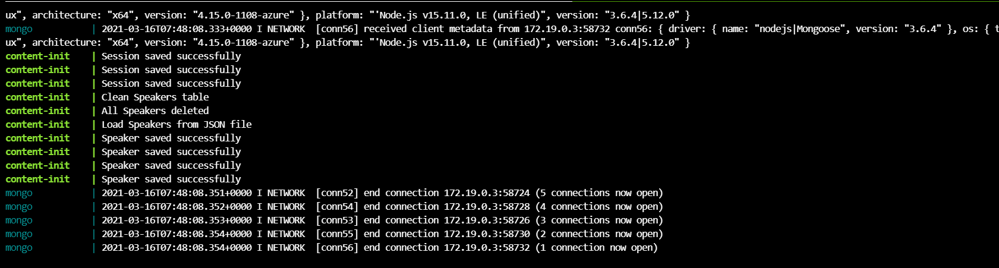

# ========== Kubernetes  ========== 
# 3) นำ Container ไปทำงานใน Kubernetes

### 3.1) Login เข้าไป Kubernetes 
กลับเข้าไปที่ Azure Cloud Shell ใช้คำสั่ง login ผ่าน Terminal
-g คือ resource group ที่ kubernetes service นั้นอยู่ 
-n คือ ชื่อ kubernetes service ของเรา
```
az login

az aks get-credentials -g fabmedical-ntt -n fabmedical-ntt
```
ทดสอบคำสั่ง Kubernetes พื้นฐาน
```
supakorn@Azure:~$ kubectl get pod
No resources found in default namespace.
supakorn@Azure:~$ kubectl get pod -A
NAMESPACE     NAME                                        READY   STATUS    RESTARTS   AGE
kube-system   coredns-79766dfd68-7h5nq                    1/1     Running   0          155m
kube-system   coredns-79766dfd68-dvprr                    1/1     Running   0          4h25m
kube-system   coredns-autoscaler-66c578cddb-9hzp5         1/1     Running   0          155m
kube-system   dashboard-metrics-scraper-6f5fb5c4f-8krtd   1/1     Running   0          155m
kube-system   kube-proxy-768z5                            1/1     Running   0          4h26m
kube-system   kubernetes-dashboard-849d5c99ff-rxhpq       1/1     Running   0          155m
kube-system   metrics-server-7f5b4f6d8c-xk9zr             1/1     Running   0          155m
kube-system   omsagent-rs-7bf9857dfc-2flsf                1/1     Running   0          155m
kube-system   omsagent-xdtf8                              1/1     Running   0          4h26m
kube-system   tunnelfront-69f4b78c9c-5krk8                1/1     Running   0          155m
```
สั่งรัน Pod พื้นฐาน
```
supakorn@Azure:~$ kubectl run --image=httpd apache -oyaml
apiVersion: v1
kind: Pod
metadata:
  creationTimestamp: "2021-03-16T08:12:24Z"
  labels:
    run: apache
  name: apache
  namespace: default
  resourceVersion: "37390"
  selfLink: /api/v1/namespaces/default/pods/apache
  uid: bb732ae9-bade-446d-a38e-07ddbfc4120e
spec:
  containers:
  - image: httpd
    imagePullPolicy: Always
    name: apache
    resources: {}
    terminationMessagePath: /dev/termination-log
    terminationMessagePolicy: File
    volumeMounts:
    - mountPath: /var/run/secrets/kubernetes.io/serviceaccount
      name: default-token-8skm2
      readOnly: true
  dnsPolicy: ClusterFirst
  enableServiceLinks: true
  priority: 0
  restartPolicy: Always
  schedulerName: default-scheduler
  securityContext: {}
  serviceAccount: default
  serviceAccountName: default
  terminationGracePeriodSeconds: 30
  tolerations:
  - effect: NoExecute
    key: node.kubernetes.io/not-ready
    operator: Exists
    tolerationSeconds: 300
  - effect: NoExecute
    key: node.kubernetes.io/unreachable
    operator: Exists
    tolerationSeconds: 300
  volumes:
  - name: default-token-8skm2
    secret:
      defaultMode: 420
      secretName: default-token-8skm2
status:
  phase: Pending
  qosClass: BestEffort
```

สั่ง Run Deployment Nginx พื้นฐาน
```
supakorn@Azure:~$ kubectl create deployment --image="docker.io/nginx" nginx -oyaml
# ผลลัพธ์
apiVersion: apps/v1
kind: Deployment
metadata:
  creationTimestamp: "2021-03-16T08:10:13Z"
  generation: 1
  labels:
    app: nginx
  name: nginx
  namespace: default
  resourceVersion: "37085"
  selfLink: /apis/apps/v1/namespaces/default/deployments/nginx
  uid: 03460f8a-25ae-46d1-b230-c6d90127ce52
spec:
  progressDeadlineSeconds: 600
  replicas: 1
  revisionHistoryLimit: 10
  selector:
    matchLabels:
      app: nginx
  strategy:
    rollingUpdate:
      maxSurge: 25%
      maxUnavailable: 25%
    type: RollingUpdate
  template:
    metadata:
      creationTimestamp: null
      labels:
        app: nginx
    spec:
      containers:
      - image: docker.io/nginx
        imagePullPolicy: Always
        name: nginx
        resources: {}
        terminationMessagePath: /dev/termination-log
        terminationMessagePolicy: File
      dnsPolicy: ClusterFirst
      restartPolicy: Always
      schedulerName: default-scheduler
      securityContext: {}
      terminationGracePeriodSeconds: 30
status: {}
```
เราควรจะเห็น pod ดั่งนี้
```
supakorn@Azure:~$ kubectl get pod
NAME                     READY   STATUS    RESTARTS   AGE
apache                   1/1     Running   0          47s
nginx-697bf8ffb8-v6n2v   1/1     Running   0          2m57s
```
อยากให้ Container สามารถเข้าถึงโลกภายนอกได้
ด้วยการสร้าง Service Type ขึ้นมาก่อน
```
supakorn@Azure:~$ kubectl expose deployment nginx --port=80 --target-port=80
service/nginx exposed
```
list service ใน Kubernetes
```
supakorn@Azure:~$ kubectl get svc

NAME         TYPE        CLUSTER-IP     EXTERNAL-IP   PORT(S)   AGE
kubernetes   ClusterIP   10.0.0.1       <none>        443/TCP   4h52m
nginx        ClusterIP   10.0.156.100   <none>        80/TCP    3m47s
```
ลองเข้าไปใน Pod Apache
```
supakorn@Azure:~$ kubectl get pod
NAME                     READY   STATUS    RESTARTS   AGE
apache                   1/1     Running   0          22m
nginx-697bf8ffb8-v6n2v   1/1     Running   0          24m

supakorn@Azure:~$ kubectl exec -it apache bash

kubectl exec [POD] [COMMAND] is DEPRECATED and will be removed in a future version. Use kubectl exec [POD] -- [COMMAND] instead.
``` 
ใช้คำสั่ง curl ไปยัง service nginx ซึ่งก็เสมือนกับ Service Discovery นั่นเอง
```
root@apache:/usr/local/apache2# apt-get update -y && apt-get install curl -y

Hit:1 http://deb.debian.org/debian buster InRelease
Hit:2 http://deb.debian.org/debian buster-updates InRelease
Hit:3 http://security.debian.org/debian-security buster/updates InRelease
Reading package lists... Done
Reading package lists... Done
Building dependency tree
Reading state information... Done
curl is already the newest version (7.64.0-4+deb10u1).
The following package was automatically installed and is no longer required:
  lsb-base
```
ทดสอบเรียก HTTP Endpoint ของ NGINX
```
root@apache:/usr/local/apache2# curl nginx
<!DOCTYPE html>
<html>
<head>
<title>Welcome to nginx!</title>
<style>
    body {
        width: 35em;
        margin: 0 auto;
        font-family: Tahoma, Verdana, Arial, sans-serif;
    }
</style>
</head>
<body>
<h1>Welcome to nginx!</h1>
<p>If you see this page, the nginx web server is successfully installed and
working. Further configuration is required.</p>

<p>For online documentation and support please refer to
<a href="http://nginx.org/">nginx.org</a>.<br/>
Commercial support is available at
<a href="http://nginx.com/">nginx.com</a>.</p>

<p><em>Thank you for using nginx.</em></p>
</body>
</html>
```
Expose Service ผ่าน Load Balancer
```
supakorn@Azure:~$ kubectl expose deployment nginx --type=LoadBalancer --target-port=80 --port=80 --name nginx-loadbalancer

service/nginx-loadbalancer exposed
```
ทดลองเช็คดูสถานะ
```
supakorn@Azure:~$ kubectl get svc
NAME                 TYPE           CLUSTER-IP     EXTERNAL-IP   PORT(S)        AGE
kubernetes           ClusterIP      10.0.0.1       <none>        443/TCP        5h1m
nginx                ClusterIP      10.0.156.100   <none>        80/TCP         13m
nginx-loadbalancer   LoadBalancer   10.0.7.77      <pending>     80:31648/TCP   49s
```
เมื่อ Service พร้อมแล้ว
```
supakorn@Azure:~$ kubectl get svc
NAME                 TYPE           CLUSTER-IP     EXTERNAL-IP     PORT(S)        AGE
kubernetes           ClusterIP      10.0.0.1       <none>          443/TCP        5h2m
nginx                ClusterIP      10.0.156.100   <none>          80/TCP         13m
nginx-loadbalancer   LoadBalancer   10.0.7.77      13.76.163.216   80:31648/TCP   92s
```
ทดลองเรียกผ่าน Browser
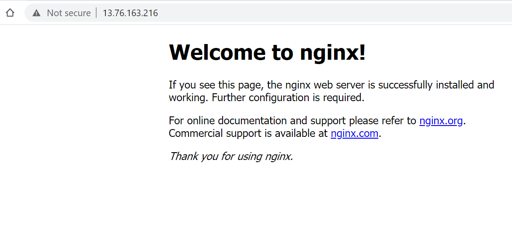

ทดลองรัน Frontend เว็บ Fabmedical ที่เราเก็บใน Private Registry เราต้องสร้าง secret ขึ้นมาก่อนซึ่ง secret ก็เสมือนกับการใช้คำสั่ง docker login นั่นเอง
```
kubectl create secret docker-registry registry-secret --docker-server=fabmedicalntt.azurecr.io --docker-username=fabmedicalntt --docker-password="JLAXzueQNn161/iiBeRCoX5VI/HTLahG"
```
เช็คดู Secret ว่ามีจริงๆหรือเปล่าโดยชื่อ secret จะต้องเป็น my-registry
```
kubectl get secret -o yaml
```

### 3.2) รัน Private Container Images

ทดลองสร้าง Deployment ใหม่โดยจะใช้ Container Image "content-web" ที่เรา push ไปเก็บก่อนหน้า
** อย่างลืมเปลี่ยนชื่อ registry-name ข้างหน้าสุดเป็นชื่อ Registry Name ของเราเองนะ
```
kubectl create deployment --image=fabmedicalntt.azurecr.io/content-web:1.0.0 -oyaml  fabmedical-monolith
```
ทดลองดู deployment จะพบว่า error มาจากการที่เราไม่มี secret ในการ Pull Image
```
kubectl get deployment
```
ลบ Deployment เดิมออกเพราะว่าขาด Secret จึงทำให้ไม่สามารถ Pull Image ได้
```
kubectl delete deployment fabmedical-monolith
```
แก้ไขปัญหานี้ด้วยการที่เพิ่ม Secret สำหรับ Pull Image เข้าไป
```
kubectl create deployment --image=fabmedicalntt.azurecr.io/content-web:1.0.0 -oyaml --dry-run fabmedical-monolith  > deployment-samenamespace.yaml
```
เพิ่ม imagePullSecrets ลงไปใน deployment file
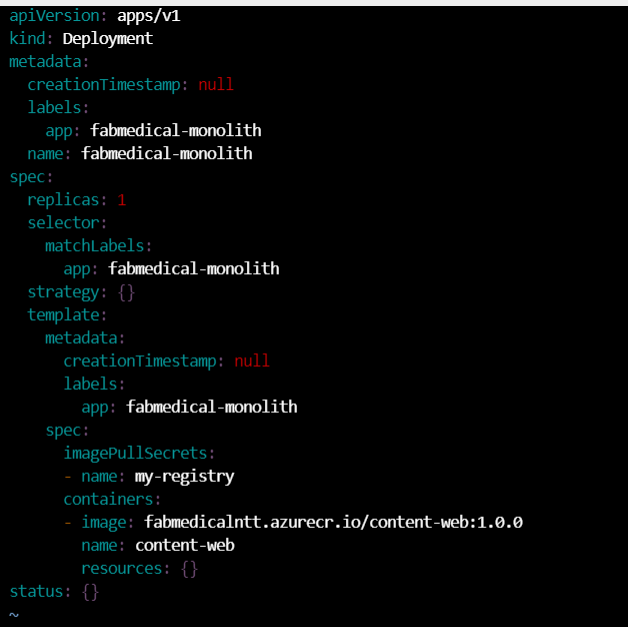
```
supakorn@Azure:~$ vi deployment-samenamespace.yaml
supakorn@Azure:~$ kubectl apply -f deployment-samenamespace.yaml
deployment.apps/fabmedical-monolith created
```
ทดลองดู Deployment ที่ทำงานได้สำเร็จ
```
supakorn@Azure:~$ kubectl get deployment
NAME                  READY   UP-TO-DATE   AVAILABLE   AGE
fabmedical-monolith   1/1     1            1           3m28s
nginx                 1/1     1            1           59m
supakorn@Azure:~$
```
Expose Service ออกไปยัง LoadBalancer
```
kubectl expose deployment fabmedical-monolith  --port=3000 --target-port=3000 --type=LoadBalancer
```
ผลลัพธ์
```
supakorn@Azure:~$ kubectl expose deployment fabmedical-monolith  --port=3000 --target-port=3000 --type=LoadBalancer
service/fabmedical-monolith exposed
supakorn@Azure:~$ kubectl get svc
NAME                  TYPE           CLUSTER-IP     EXTERNAL-IP     PORT(S)          AGE
fabmedical-monolith   LoadBalancer   10.0.31.170    <pending>       3000:31411/TCP   4s
kubernetes            ClusterIP      10.0.0.1       <none>          443/TCP          5h32m
nginx                 ClusterIP      10.0.156.100   <none>          80/TCP           43m
nginx-loadbalancer    LoadBalancer   10.0.7.77      13.76.163.216   80:31648/TCP     31m
```
รอจนกระทั่ง LoadBalacner นั้น Provisioning สำเร็จเราจะสามารถไป Access ได้ผ่าน External IP นั้น
```
supakorn@Azure:~$ kubectl get svc
NAME                  TYPE           CLUSTER-IP     EXTERNAL-IP     PORT(S)          AGE
fabmedical-monolith   LoadBalancer   10.0.31.170    52.148.72.200   3000:31411/TCP   46s
kubernetes            ClusterIP      10.0.0.1       <none>          443/TCP          5h32m
nginx                 ClusterIP      10.0.156.100   <none>          80/TCP           44m
nginx-loadbalancer    LoadBalancer   10.0.7.77      13.76.163.216   80:31648/TCP     32m
```
จะได้ External IP 52.148.72.200 เดียวกันนั่นเอง
แต่กระนั้นเราก็จะยังไม่มีข้อมูลเลยเพราะว่าเรายังไม่มี Database และ Backend API


### 3.3) Deploy Container
เราจะทดลอง Deploy Container แยกกันและเชื่อมให้ Service 
โดยจะเริ่มจาก MongoDB ก่อน

##### 3.3.1) สร้าง MongoDB
```
kubectl create deployment --image=docker.io/mongo:4.0 mongo

deployment.apps/mongo created

supakorn@Azure:~$ kubectl get deployment
NAME                  READY   UP-TO-DATE   AVAILABLE   AGE
fabmedical-monolith   0/1     1            0           14m
mongo                 1/1     1            1           6s
nginx                 1/1     1            1           105m
```
Expose Service ของ MongoDB ที่ Port 27017 ภายใน Cluster เพื่อให้ Service อื่นสามารถติดต่อเข้ามาได้อย่าง content-init เพื่อการ seeding database
```
kubectl expose deployment --type=ClusterIP mongo --target-port=27017 --port=27017
```
แสดงผลจะต้องเห็น Service MongoDB
```
supakorn@Azure:~$ kubectl get svc
NAME                  TYPE           CLUSTER-IP     EXTERNAL-IP     PORT(S)          AGE
fabmedical-monolith   LoadBalancer   10.0.31.170    52.148.72.200   3000:31411/TCP   46m
kubernetes            ClusterIP      10.0.0.1       <none>          443/TCP          6h18m
mongo                 ClusterIP      10.0.27.61     <none>          27017/TCP        5s
nginx                 ClusterIP      10.0.156.100   <none>          80/TCP           90m
nginx-loadbalancer    LoadBalancer   10.0.7.77      13.76.163.216   80:31648/TCP     78m
```
##### 3.3.2) สร้าง Configmap ใช้เก็บ Environment Variable ไว้ก่อน
อย่างที่เราเคยทำใน Docker ไปเราพบว่าเวลาเรารัน Docker-Compose หรือจะรัน Container เดียวๆเราก็ต้อง inject Environment Variable ลงไปเพื่อให้เวลา Run Time Start นั้นนำ Envrionment ไปใช้ใน Code ใน Kubernetes 
###### เราจะใช้ ConfigMap "fabmedical-config"
```
kubectl create configmap fabmedical-config --from-literal="MONGODB_CONNECTION=mongodb://mongo:27017/contentdb"  --from-literal="CONTENT_API_URL=http://content-api:3001"
```
ตรวจสอบ configmap ที่สร้างขึ้นมา
```
kubectl get configmap fabmedical-config -oyaml
```
ผลลัพธ์
```
supakorn@Azure:~$ kubectl get configmap fabmedical-config -oyaml
apiVersion: v1
data:
  CONTENT_API_URL: http://content-api:3001
  MONGODB_CONNECTION: mongodb://mongo:27017/contentdb
kind: ConfigMap
metadata:
  creationTimestamp: "2021-03-16T10:05:35Z"
  name: fabmedical-config
  namespace: default
  resourceVersion: "52722"
  selfLink: /api/v1/namespaces/default/configmaps/fabmedical-config
  uid: 2d1e4146-72b5-4c08-a939-5a534821d46d
```

##### 3.3.3) สร้าง content-init เพื่อ seeding database เข้า MongoDB
ใช้คำสั่งสร้าง Template Container
```
kubectl run --image=fabmedicalntt.azurecr.io/content-init:1.0.1 --dry-run -oyaml  content-init   > content-init.yaml
```
เราจะได้ Template Container content-init มาซึ่งอย่าลืมว่าเราต้องระบุ Envrionment Variable เหมือนตอนทำใน Docker เช่นเดียวกัน
ดังนั้นเราต้องสร้าง environment variable สำหรับ Endpoint MongoDB ก่อน


เพิ่ม imagePullSecrets ไปที่ไฟล์ "content-init" พร้อมกับ environment variable ที่สร้างในขั้นตอนก่อนหน้า และใช้ restartPolicy เป็น Never เพราะหลังจาก seed data เสร็จเราไม่จำเป้นต้องใช้อีกต่อไป
```
apiVersion: v1
kind: Pod
metadata:
  creationTimestamp: null
  labels:
    run: content-init
  name: content-init
spec:
  imagePullSecrets:
  - name: my-registry
  containers:
  - image: fabmedicalntt.azurecr.io/content-init:1.0.1
    name: content-init
    resources: {}
    env:
    - name: MONGODB_CONNECTION
      valueFrom:
        configMapKeyRef:
          name: fabmedical-config
          key: MONGODB_CONNECTION
  dnsPolicy: ClusterFirst
  restartPolicy: Never
status: {}
```
สั่งสร้าง Pod content-init
```
kubectl apply -f content-init
```
ตรวจสอบดู logs ของ pod content-init
```
supakorn@Azure:~$ kubectl logs -f content-init

> content-init@1.0.0 start
> node server.js

Clean Sessions table
(node:17) Warning: Accessing non-existent property 'MongoError' of module exports inside circular dependency
(Use `node --trace-warnings ...` to show where the warning was created)
(node:17) DeprecationWarning: collection.remove is deprecated. Use deleteOne, deleteMany, or bulkWrite instead.
Connected to MongoDb
All Sessions deleted
Load sessions from JSON file
Session saved successfully
Session saved successfully
Session saved successfully
Session saved successfully
Clean Speakers table
All Speakers deleted
Load Speakers from JSON file
Speaker saved successfully
Speaker saved successfully
Speaker saved successfully
Speaker saved successfully
npm notice
npm notice New patch version of npm available! 7.6.0 -> 7.6.3
npm notice Changelog: <https://github.com/npm/cli/releases/tag/v7.6.3>
npm notice Run `npm install -g npm@7.6.3` to update!
npm notice
```
##### 3.3.4) สร้าง content-api ต่อไปยัง MongoDB ที่มีข้อมูลแล้ว
สร้าง Template content-api 
```
kubectl create deployment --image=fabmedicalntt.azurecr.io/content-api:1.0.1 --dry-run content-api  -oyaml > content-api.yaml
```
เพิ่ม iamgePullSecrets สำหรับ Pull Private Container Images และเซ็ท Environment Variable จาก Configmap เหมือนเดิม
```
apiVersion: apps/v1
kind: Deployment
metadata:
  creationTimestamp: null
  labels:
    app: content-api
  name: content-api
spec:
  replicas: 1
  selector:
    matchLabels:
      app: content-api
  strategy: {}
  template:
    metadata:
      creationTimestamp: null
      labels:
        app: content-api
    spec:
      imagePullSecrets:
      - name: my-registry
      containers:
      - image: fabmedicalntt.azurecr.io/content-api:1.0.1
        name: content-api
        resources: {}
        env:
        - name: MONGODB_CONNECTION
          valueFrom:
            configMapKeyRef:
              name: fabmedical-config
              key: MONGODB_CONNECTION

status: {}
```
สั่งสร้าง container content-api 
```
supakorn@Azure:~$ kubectl apply -f content-api.yaml
deployment.apps/content-api created
```
แสดงผลลัพธ์
```
supakorn@Azure:~$ kubectl get pod
NAME                           READY   STATUS      RESTARTS   AGE
apache                         1/1     Running     0          138m
content-api-5bfb8895b4-vl9tg   1/1     Running     0          16s
content-init                   0/1     Completed   0          10m
mongo-6755f5794b-bd7nv         1/1     Running     0          35m
nginx-697bf8ffb8-v6n2v         1/1     Running     0          140m
```
ดู Logs จาก content-api Pod
```
supakorn@Azure:~$ kubectl logs -f content-api-5bfb8895b4-vl9tg

> content-api@0.0.0 start
> node ./server.js

(node:17) Warning: Accessing non-existent property 'MongoError' of module exports inside circular dependency
(Use `node --trace-warnings ...` to show where the warning was created)
Listening on port 3001
Connected to MongoDB
```
ทำการ Expose Backend content-api มาเป็น Service ใน Kubernetes เพื่อให้ Frontend สามารถนำไปใช้ต่อได้ผ่าน Container "content-web"

```
supakorn@Azure:~$ kubectl expose deployment content-api --type=ClusterIP --port=3001 --target-port=3001
service/content-api exposed

supakorn@Azure:~$ kubectl get svc
NAME                  TYPE           CLUSTER-IP     EXTERNAL-IP     PORT(S)          AGE
content-api           ClusterIP      10.0.131.22    <none>          3001/TCP         4s
fabmedical-monolith   LoadBalancer   10.0.31.170    52.148.72.200   3000:31411/TCP   83m
kubernetes            ClusterIP      10.0.0.1       <none>          443/TCP          6h55m
mongo                 ClusterIP      10.0.27.61     <none>          27017/TCP        37m
nginx                 ClusterIP      10.0.156.100   <none>          80/TCP           127m
nginx-loadbalancer    LoadBalancer   10.0.7.77      13.76.163.216   80:31648/TCP     114m
```
ทดลองดูว่า Backend API ใช้งานได้จริงๆหรือเปล่าโดยการเข้าไปที่ Pod Apache ที่เราสร้างไว้ก่อนหน้าและติดตั้ง curl ไว้แล้ว

```
supakorn@Azure:~$ kubectl get pod
NAME                           READY   STATUS      RESTARTS   AGE
apache                         1/1     Running     0          143m
content-api-5bfb8895b4-vl9tg   1/1     Running     0          4m47s
content-init                   0/1     Completed   0          14m
mongo-6755f5794b-bd7nv         1/1     Running     0          40m
nginx-697bf8ffb8-v6n2v         1/1     Running     0          145m

supakorn@Azure:~$ kubectl exec -it apache bash
kubectl exec [POD] [COMMAND] is DEPRECATED and will be removed in a future version. Use kubectl exec [POD] -- [COMMAND] instead.

root@apache:/usr/local/apache2# curl content-api:3001/sessions

[{"_id":"54b321f979cfa6002dd73477","speakerNames":["Theresa Zesiewicz","Kevin Allison","Israt Jahan","Jessica Shaw","F. Reed Murtagh","Tracy Jones","Clifton Gooch","Jason Salemi","Matthew B. Klein","Guy Miller","Kelly Sullivan"],"speakers":[],"trackNames":["Visual Studio/Azure intersection","ASP.NET / HTML5 intersection"],"tracks":["124","125"],"__v":0,"abstract":"<b>Objective:</b> To evaluate the effects of EPI-743in subjects with Parkinson’s disease (PD).<br/><b>Background:</b> Oxidative stress and energetic disturbances are thought to contribute to the pathogenesis of PD. EPI-743 (alpha-tocotrienol quinone) is an investigational drug targeting oxidoreductase enzymes essential for redox control of metabolism. In preclinical tests on primary cells from sporadic and mito-PD variants, EPI-743 provides protection against oxidative stress secondary to glutathione depletion.<br/><b>Methods:</b> This was a 6-month open label trial comparing 2 dose levels of orally administered EPI-743 (200 mg or 400 mg TID). Study outcomes included changes from baseline in UPDRS II and III “ON” scores, and brain metabolite levels as measured by 3T magnetic resonance spectroscopy (MRS). Wi
```
ออกมาจาก Pod และสร้าง Deplyoment สุดท้ายคือ content-web

##### 3.3.5) สร้าง content-web ต่อไปยัง content-api ที่เป็น Backend

สร้าง Template content-web 
```
kubectl create deployment --image=fabmedicalntt.azurecr.io/content-web:1.0.1 --dry-run content-web  -oyaml > content-web.yaml
```
เพิ่ม imagePullSecrets สำหรับ Pull Private Container Images และเซ็ท Environment Variable จาก Configmap เหมือนเดิม
** สังเกต Envrionment Variable ดีๆจะใช้เป็นตัวแปรของ Backend แทนไม่ใช่ตัวแปรที่ต่อตรงไปหา MongoDB 
content-web.yaml
```
apiVersion: apps/v1
kind: Deployment
metadata:
  creationTimestamp: null
  labels:
    app: content-web
  name: content-web
spec:
  replicas: 1
  selector:
    matchLabels:
      app: content-web
  strategy: {}
  template:
    metadata:
      creationTimestamp: null
      labels:
        app: content-web
    spec:
      containers:
      - image: fabmedicalntt.azurecr.io/content-web:1.0.1
        name: content-web
        resources: {}
        env:
        - name: CONTENT_API_URL
          valueFrom:
            configMapKeyRef:
              name: fabmedical-config
              key: CONTENT_API_URL

status: {}
```
สั่งสร้าง Deployment ตาม Template
```
supakorn@Azure:~$ kubectl apply -f content-web.yaml
deployment.apps/content-web configured
supakorn@Azure:~$ kubectl get pod
NAME                           READY   STATUS      RESTARTS   AGE
apache                         1/1     Running     0          174m
content-api-5bfb8895b4-vl9tg   1/1     Running     0          36m
content-init                   0/1     Completed   0          46m
content-web-64ccfffdb-wmn5g    1/1     Running     0          34s
mongo-6755f5794b-bd7nv         1/1     Running     0          71m
nginx-697bf8ffb8-v6n2v         1/1     Running     0          176m
```
เราจะทำการ Expose Deployment content-web ให้สามารถ access จากภายนอกได้ผ่าน การสร้าง Kubernetes Servcie LoadBalancer ซึ่งจะไปสร้างต่อบน Azure
```
kubectl expose deployment content-web --type=LoadBalancer  --target-port=3000 --port=3000
```
แสดงเว็บที่ Deploy สำเร็จผ่าน Browser
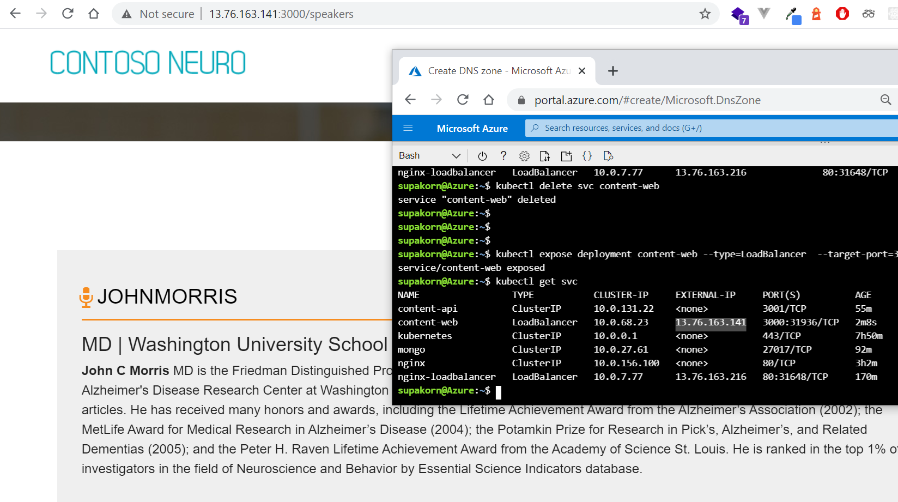
```
# Create a namespace for your ingress resources
kubectl create namespace ingress-basic

# Add the ingress-nginx repository
helm repo add ingress-nginx https://kubernetes.github.io/ingress-nginx

# Use Helm to deploy an NGINX ingress controller
helm install nginx-ingress ingress-nginx/ingress-nginx \
    --namespace ingress-basic \
    --set controller.replicaCount=2 \
    --set controller.nodeSelector."beta\.kubernetes\.io/os"=linux \
    --set defaultBackend.nodeSelector."beta\.kubernetes\.io/os"=linux \
    --set controller.admissionWebhooks.patch.nodeSelector."beta\.kubernetes\.io/os"=linux
```
เช็คดู Ingress
```
supakorn@Azure:~$ kubectl get service -n ingress-basic
NAME                                               TYPE           CLUSTER-IP   EXTERNAL-IP     PORT(S)                      AGE
nginx-ingress-ingress-nginx-controller             LoadBalancer   10.0.33.66   13.76.166.131   80:30605/TCP,443:30074/TCP   2m1s
nginx-ingress-ingress-nginx-controller-admission   ClusterIP      10.0.40.63   <none>          443/TCP                      2m1s
```
สร้าง Ingress Endpoint
fabmedical-ingress.yaml
```
apiVersion: networking.k8s.io/v1beta1
kind: Ingress
metadata:
  name: fabmedical-ingress-static
  annotations:
    kubernetes.io/ingress.class: nginx
    nginx.ingress.kubernetes.io/ssl-redirect: "false"
    nginx.ingress.kubernetes.io/rewrite-target: /$1
spec:
  rules:
  - http:
      paths:
      - backend:
          serviceName: content-web
          servicePort: 3000
        path: /(.*)
```
สร้าง  ingress
```
kubectl apply -f fabmedical-ingress.yaml
```


# DevOps Pipeline
ให้เรา copy file content-web.yaml ไปวางที่ directory ของ content-api และแก้ไขไฟล์ให้มี annotations และ image ให้แก้เป็นใช้ TAG ดั่งตัวอย่างคำสั่ง
content-web.yaml
```
apiVersion: apps/v1
kind: Deployment
metadata:
  creationTimestamp: null
  annotations:
    kubernetes.io/change-cause: "ENV_CHANGE_CAUSE_MESSAGE"
  labels:
    app: content-web
  name: content-web
spec:
  replicas: 1
  selector:
    matchLabels:
      app: content-web
  strategy: {}
  template:
    metadata:
      creationTimestamp: null
      labels:
        app: content-web
    spec:
      containers:
      - image: fabmedicalntt.azurecr.io/content-web:IMAGE_BUILD_ID
        name: content-web
        resources: {}
        env:
        - name: CONTENT_API_URL
          valueFrom:
            configMapKeyRef:
              name: fabmedical-config
              key: CONTENT_API_URL

status: {}
```

และแก้ไขไฟล์ให้เชื่อม Connection ระหว่าง Azure DevOps ไปยัง Kubernetes และ Private Container Registry 


เพิ่มไฟล์ azure-pipelines.yml ใน directory ของ web-content ให้มีค่าดั่งโค้ดนี้
```
# Docker
# Build and push an image to Azure Container Registry
# https://docs.microsoft.com/azure/devops/pipelines/languages/docker

trigger:
- master

resources:
- repo: self

variables:
  # Container registry service connection established during pipeline creation
  dockerRegistryServiceConnection: 'e73fe898-4885-43e4-8fad-13b571df363b'
  imageRepository: 'content-web'
  containerRegistry: 'fabmedicalntt.azurecr.io'
  dockerfilePath: '$(Build.SourcesDirectory)/Dockerfile'
  tag: '$(Build.BuildId)'
  commitMessage: '$(Build.SourceVersionMessage)'

  # Agent VM image name
  vmImageName: 'ubuntu-latest'

pool:
  name: build


steps:
    - task: Docker@2
      displayName: Build and push an image to container registry
      inputs:
        command: buildAndPush
        repository: $(imageRepository)
        dockerfile: $(dockerfilePath)
        containerRegistry: $(dockerRegistryServiceConnection)
        tags: |
          $(tag)
    
    - task: CmdLine@2
      displayName: Replace Environment Variable
      inputs:
        script: |
          sed -i "s/IMAGE_BUILD_ID/$(tag)/g" content-web.yaml
          sed -i "s/ENV_CHANGE_CAUSE_MESSAGE/[IMAGE] $(tag) - $(commitMessage)/g" content-web.yaml
    
    - task: KubernetesManifest@0
      displayName: Deploy Kubernetes
      inputs:
        action: 'deploy'
        kubernetesServiceConnection: 'deploy-default-namespace'
        namespace: 'default'
        manifests: 'content-web.yaml'
    
```
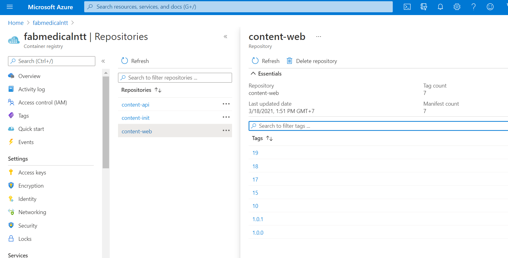

ทดลองแก้ไข content ใน Frontend แล้วจะพบว่าหน้าของการอัพเดทรายละเอยีดนั้นจะอัพเดทขึ้นใน rollout history
```
kubectl rollout history deployment content-web
```
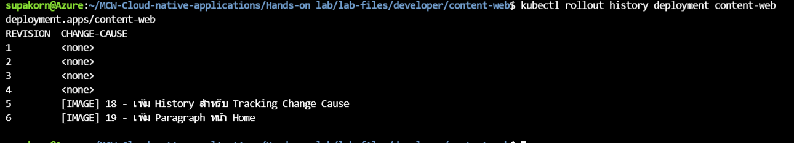

หน้าเว็บจะมีการอัพเดทตามที่เราแก้ไป พร้อมทั้ง Tracking ได้อีกด้วย
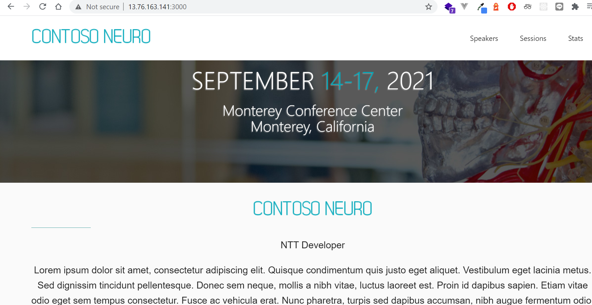